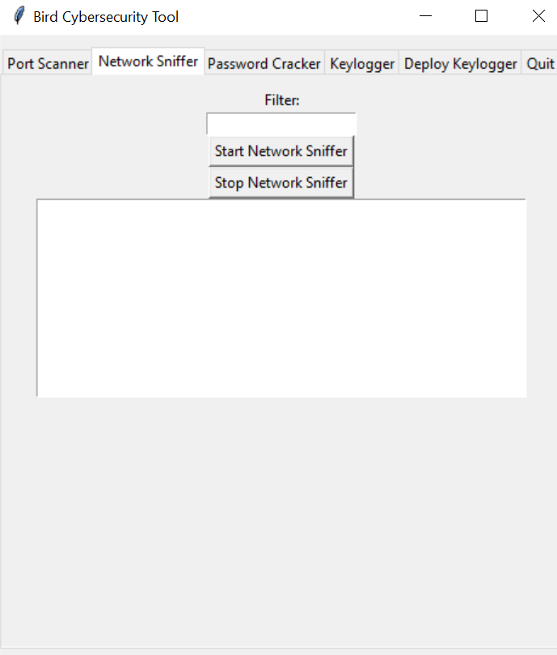
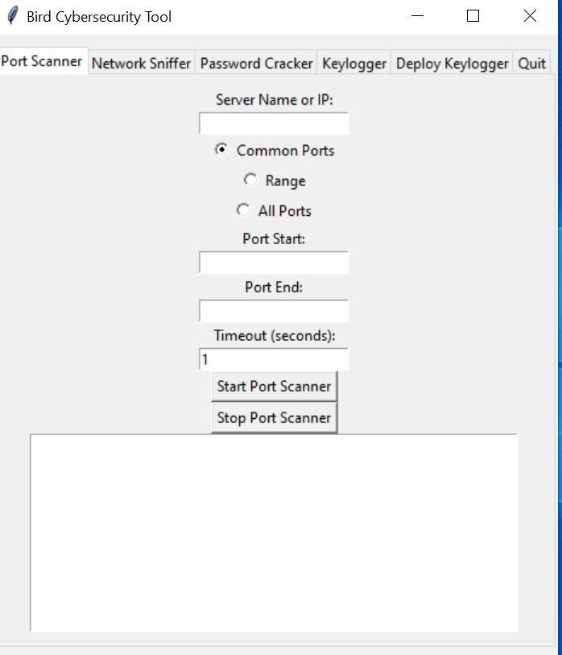
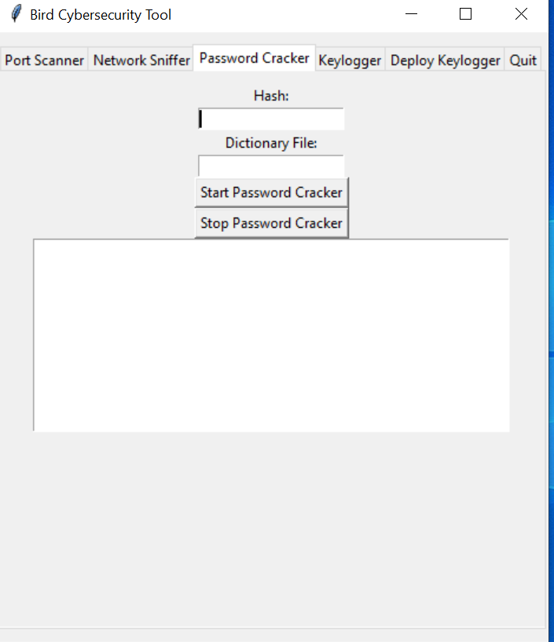
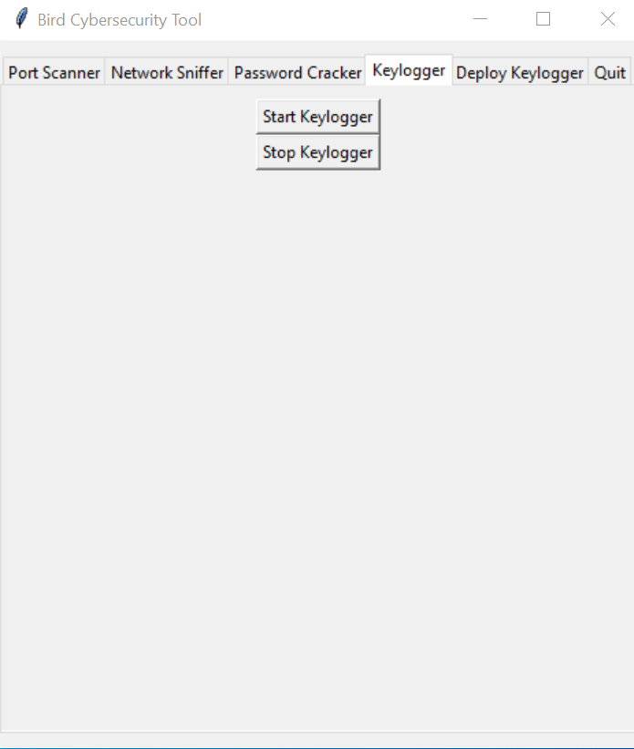
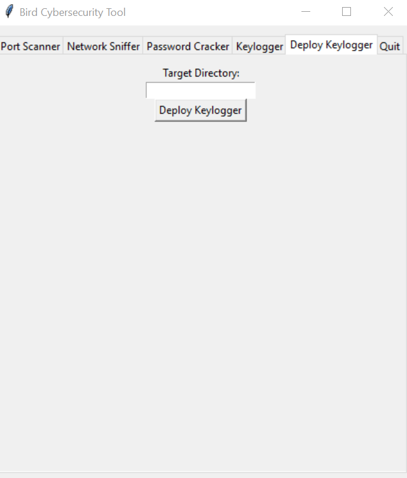

## Bird by Aniya Stanford

## Description
Bird is an application that integrates multiple cybersecurity tools into one application for easier use. Purpose of Bird is to make it easier for beginners and cybersecurity professionals to use a tool without needing multiple scripts to utilize specific functions. To offer a fast-paced process with time-efficient solutions. Despite the existence of similar applications, Bird is still considered a great tool due to its unique advantages.

## Warning
For Educational Purposes only. I'm not responsible for any malicious intent conducted using this application.

## Table of Contents
- [Installation](#installation)
- [Usage](#usage)
- [Screenshots](#screenshots)

## Installation
1. Clone the repository:
   ```bash
   git clone https://github.com/username/repository-name.git
2. Navigate to the project directory:
    ```bash
   cd repository-name
4. Install dependencies:
    ```bash
   npm install

## Usage
Ensure an easily structured application that can be utilized by anyone regardless of skill level in Cybersecurity.


## Screenshots
### Example One:


### Example Two:


### Example Three:


### Example Four:


### Example Five:


### Example Six:


